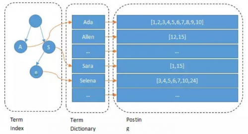
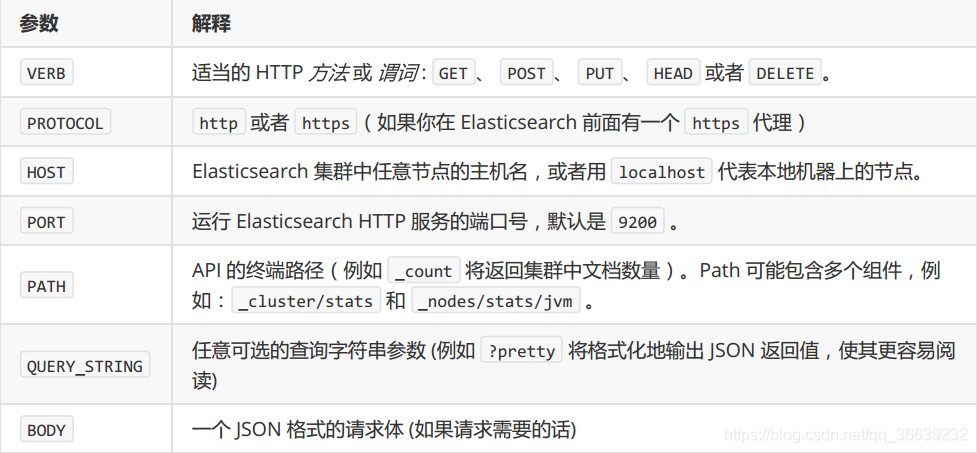

## Elasticsearch 是什么 ##

> Elasticsearch is a highly scalable open-source full-text search and analytics engine.It allows you to store, search, and analyze big volumes of data quickly and in near real time.[参考](https://www.elastic.co/gsuide/en/elasticsearch/reference/6.0/getting-started.html)
>
> Elasticsearch 是一个高度可扩展的开源全文搜索和分析引擎，可以近乎实时地快速存储、搜索和分析大量数据。

### 重要的特点 `高度可扩展`、`实时`、`存储`、`搜索`、`分析` ### 

> Elasticsearch 的本身扩展性很好（注重于核心功能，高级功能多有第三方插件提供），可以扩展到上百台服务器，处理PB级别的数据。

## Elasticsearch 的作用和原理 ##

### 作用 ###

> 在日常开发中，数据库也能做到（实时、存储、搜索、分析）。相对于数据库，Elasticsearch 的强大之处就是可以 `模糊查询` 。
>
> 在数据库中，我们需要模糊搜索某个数据时，一般使用 `like '%data%'` 进行模糊查询，但是这种查询方式是不走索引的，如果在数据量为上千万或上亿级时，查询的性能会迅速下降。如果我们想实现秒级的模糊查询，就得使用 Elasticsearch 。
>
> Elasticsearch 最常见的场景就是我们的 [搜索引擎](https://cn.bing.com/) ，每次我们在搜索引擎输入一些关键字的时候，就能帮我们找到近似的结果。
> 
> 但是，只能用来做**数据检索**，并不能友好的维护**关联关系**，维护对象之间的关联，还是用关系型数据库产品

### 原理 ###



> Elasticsearch 使用Lucene作为其核心来实现所有索引和搜索的功能，但是它的目的是通过简单的 RESTful API 来隐藏 Lucene 的复杂性，从而让全文搜索变得简单。
>
> Elasticsearch 实现快速的 `模糊匹配、相关性查询`， 实际上是它会在你写入数据到 Elasticsearch 的时候会进行**分词**。
> 
> 在搜索引擎中输入一段文字，Elasticsearch 会通过分词器对查询的文字进行分词，这些分词汇总起来就是 `Term Dictionary` ，然后通过分词找到对应的记录，这些文档点 `token` 保存在 `PostingList` 。
> 
> 如果 `Term Dictionary` 中的词由于是非常的多，所以会为其进行**排序**，等要查找的时候，就可以通过**二分**查询，不需要遍历整个 `Term Dictionary`。
> 
> 如果 `Term Dictionary` 的词继续增加，不可能把 `Term Dictionary` 所有的词都放在内存中，于是 Elasticsearch 还设计了一层叫做 `Term Index`，这层只存储部分词的**前缀**，`Term Index` 会存在内存中，从而保证了检索的速度。

## Elasticsearch 的数据类型 ##

> Elasticsearch 的数据结构相对于 MySQL，给出如下的对应关系表会更好理解。  仅支持Json文件格式；

| MySQL | Elasticsearch | 描述 |
| :---: | :---: | :--- |
| DataBase | Index | MySQL 中的数据库（DataBase），等价于 ES 中的索引（Index） |
| Table | Type | MySQL 中一个数据库下面有 N 张表（Table），等价于1个索引 Index 下面有 N 多类型（Type） |
| Row | Document |  |
| Column | Field | MySQL 中一个数据库表（Table）下的数据由多行（Row）多列（Column，属性）组成，等价于1个 Type 由多个文档（Document）和多个域（Field）组成 |
| Schema | Mapping | MySQL 中定义表结构、设定字段类型等价于 ES 中的 Mapping |
| Index | 每个元素都是索引 | 索引是一些具有相似特征的文档集合 |
| SQL | Query DSL | Domain Specific Language：领域特定语言 |

> 1一个索引就是一个拥有几分相似特征的文档的集合。比如说，你可以有一个客户数据的索引，另一个产品目录的索引，还有一个订单数据的索引。一个索引由一个名字来标识（必须全部是小写字母的），并且当我们要对对应于这个索引中的文档进行索引、搜索、更新和删除的时候，都要使用到这个名字。在一个集群中，可以定义任意多的索引。
>
> 2在一个索引中，你可以定义一种或多种类型。一个类型是你的索引的一个逻辑上的分类/分区，其语义完全由你来定。通常，会为具有一组共同字段的文档定义一个类型。比如说，我们假设你运营一个博客平台并且将你所有的数据存储到一个索引中。在这个索引中，你可以为用户数据定义一个类型，为博客数据定义另一个类型，当然，也可以为评论数据定义另一个类型。
>
> 5举例说明，在一个关系型数据库里面，Schema 定义了表、每个表的字段，还有表和字段之间的关系。在 ES 中，Mapping 定义索引下的 Type 的字段处理规则，即索引如何建立、索引类型、是否保存原始索引 JSON 文档、是否压缩原始 JSON 文档、是否需要分词处理、如何进行分词处理等。

## Elasticsearch 的接口语法 ##

```shell
curl ‐X<VERB> '<PROTOCOL>://<HOST>:<PORT>/<PATH>?<QUERY_STRING>' ‐d '<BODY>'
```




## 最后 ##
> 只是简单的介绍一下ES的一些基础知识，给大家分享一下ES这个工具，让大家了解ES；后续有机会继续分享ES的压缩算法，集群，分片，副本复制等，以及相关技术的实践应用。

[ElasticSearch 参考](https://www.cnblogs.com/coderxz/p/13268417.html#11elasticsearch%E7%9A%84%E4%BD%BF%E7%94%A8%E6%A1%88%E4%BE%8B)
[ElasticSearch 参考](https://my.oschina.net/u/3620858/blog/5072657?_from=gitee_rec)