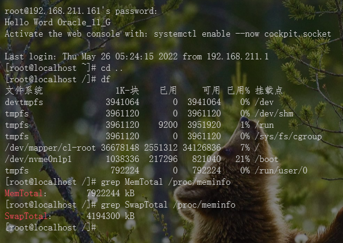

# Centos8 环境下 Oracle 11 G 的安装配置 #
### 注意看我的标题！！！！我这是针对 Oracle Database 11g 第 2 版 (11.2.0.1.0) 版本 ###
## 一、检查本地是否安装 ##
### 1、系统配置检查 ###
> ##### 物理内存不小于1G: 查看方式: #####
    grep MemTotal /proc/meminfo
> ##### 可用硬盘不小于8G: 查看方式: #####
    df
> ##### Swap分区空间不小于2G: 查看方式: #####
    grep SwapTotal /proc/meminfo

### 2、 修改 `CentOS` 系统标识 （ `Oracle` 默认不支持 `CentOS`）  ###
    vim /etc/redhat-release
> 修改为 `redhat-8` 

### 3、修改内核参数 ###
    vim /etc/sysctl.conf
> 追加以下内容
```
fs.aio-max-nr = 1048576
fs.file-max = 6815744
kernel.shmmni = 4096
kernel.sem = 250 32000 100 128
kernel.shmall = 2097152
kernel.shmmax = 2147483648
net.ipv4.ip_local_port_range = 9000 65500
net.ipv4.icmp_echo_ignore_broadcasts = 1
net.ipv4.conf.all.rp_filter = 1
net.core.rmem_default = 262144
net.core.rmem_max= 4194304
net.core.wmem_default= 262144
net.core.wmem_max= 1048576
```
> 修改完后,启用新的配置:
```
sysctl -p
```

### 4、安装必须的依赖 ###
> 安装 epel 源
```shell
yum install epel-release
```

> 安装依赖组件
```shell
yum -y install libnsl
```

```shell
yum -y install binutils* compat-libcap1 compat-libstdc++-33 gcc* gcc-c++* glibc* glibc-devel* ksh* libaio* libaio-devel* libgcc* libstdc++* libstdc++-devel* libXi* libXtst* make* sysstat* elfutils* unixODBC* unzip lrzsz
```

## 二、下载 ##
### 1、下载地址 ###
    https://www.oracle.com/cn/database/enterprise-edition/downloads/oracle-db11g-linux.html
##### 注意需要登录 Oracle 帐号， 下载完成之后上传 Centos #####
## 三、解压操作文件 ##
### 1、切换到 `/usr/local/` 文件夹下
```shell
cd /usr/local/
```
> 将两个数据库文件压缩包上传到此目录下
### 2、解压 ###
```shell
unzip -d /usr/local/ linux.x64_11gR2_database_1of2.zip
unzip -d /usr/local/ linux.x64_11gR2_database_2of2.zip
```
### 3、创建用户组、用户 ###
#### 创建安装 `Oracle` 程序用户组 ####
```shell
groupadd oinstall
```
#### 创建 `DBA` 用户组
```shell
groupadd dba
```
#### 创建 `oracle` 用户并加入 'DBA' 用户组
```shell
useradd -g dba -m oracle
```
#### 将用户 `oracle` 加入到  `oinstall` 组 ####
```shell
usermod -a -G oinstall oracle
```
#### 修改用户 `oracle` 的密码 ####
```shell
passwd oracle
```
#### 修改目录权限 ####
```shell
chown -R oracle:oinstall /usr/local/database
chown -R oracle:oinstall /usr/local/oracle
```
#### 修改 `oracle` 用户的安全性能设置 ####
```shell
vim /etc/security/limits.conf
```
> 在最后一行前追加以下内容：
```shell
oracle soft nproc 2047
oracle hard nproc 16384
oracle soft nofile 1024
oracle hard nofile 65536
```
#### 修改用户环境变量 #### **************
```shell
vim /home/oracle/.bashrc
```
> 追加以下内容
```shell
export PATH
export ORACLE_BASE=/usr/local/oracle
export ORACLE_HOME=$ORACLE_BASE/product/11.2.0/db_1
export ORACLE_SID=orcl
export ORACLE_UNQNAME=orcl
export PATH=$ORACLE_HOME/bin:/usr/sbin:$PATH
export LD_LIBRARY_PATH=$ORACLE_HOME/lib:/lib:/usr/lib
export LANG=C0
export NLS_LANG=AMERICAN_AMERICA.AL32UTF8
```
> 修改完后立即启用:
```shell
source /home/oracle/.bashrc
```
#### 关闭 `selinux` ####
```shell
/etc/selinux/config
```
> 修改以下内容
```shell
# This file controls the state of SELinux on the system.
# SELINUX= can take one of these three values:
#     enforcing - SELinux security policy is enforced.
#     permissive - SELinux prints warnings instead of enforcing.
#     disabled - No SELinux policy is loaded.
SELINUX=disabled      # ********修改此行******
# SELINUXTYPE= can take one of three two values:
#     targeted - Targeted processes are protected,
#     minimum - Modification of targeted policy. Only selected processes are protected. 
#     mls - Multi Level Security protection.
SELINUXTYPE=targeted
```
> 保存后需要重启机器
```shell
reboot
```


### 2、防火墙端口开放 ###
#### 解决 ####
##### 1、查看防火墙状态 #####
	firewall-cmd --state
##### 2、关闭防火墙 #####
	systemctl stop firewalld.service
##### 3、禁止防火墙开机自启 #####
	systemctl disable firewalld.service
##### 4、开启防火墙 #####
	systemctl start firewalld.service
##### 5、Add 添加开放端口 #####
	firewall-cmd --permanent --zone=public --add-port=3306/tcp
##### 6、Reload 重新加载 #####
	firewall-cmd --reload
##### 7、检查是否生效 ######
	firewall-cmd --zone=public --query-port=3306/tcp
##### 8、删除开放端口 ######
    firewall-cmd --zone=public --remove-port=8088/tcp --permanent
### 3、`temporary failure in name resolution` 问题，或者是服务正常启动，访问效率特别慢（适用于MySQL\MyCat\TomCat） ###
