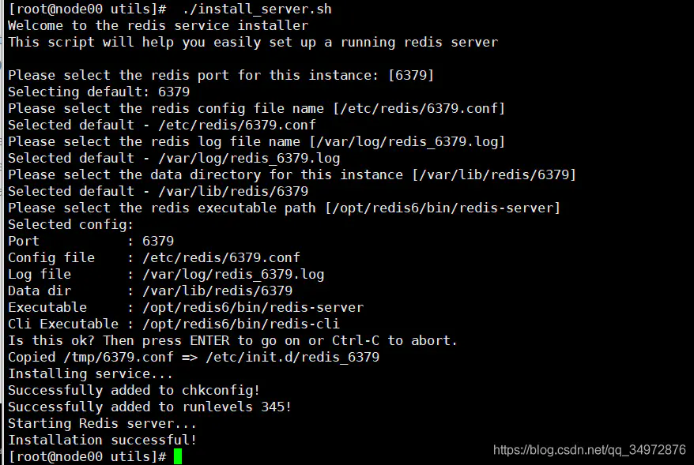

# Centos7环境下Redis的安装配置 #
## 一、检查本地是否安装 ##
### 1、检查 ###
```shell
rpm -qa | grep redis
```
### 2、卸载 ###
```shell
rpm -e redis
```
## 二、下载 ##
### 1、wget方式下载 ###
```shell
wget http://download.redis.io/releases/redis-6.2.6.tar.gz
```
##### 若报错：`-bash: wget: command not found` 表明没有安装wget，需要执行如下命令安装： #####
```shell
yum -y install wget
```
## 三、解压操作文件 ##
### 1、解压 ###
```shell
tar -zxvf redis-6.2.6.tar.gz -C /usr/local/
```
### 2、编译文件 ###
```shell
cd /usr/local/redis-6.2.6/

ls -a

yum -y install make

make
```
#### 3、出现问题 ####
```shell
cd src && make all
make[1]: 进入目录“/software/redis-6.2.6/src”
CC Makefile.dep
make[1]: 离开目录“/software/redis-6.2.6/src”
make[1]: 进入目录“/software/redis-6.2.6/src”
CC adlist.o
/bin/sh: cc: 未找到命令
make[1]: *** [adlist.o] 错误 127
make[1]: 离开目录“/software/redis-6.2.6/src”
make: *** [all] 错误 2
```
#### 4、解决方案 ####
##### 安装gcc环境 #####
```shell
yum install gcc-c++
```
##### 升级 #####
```shell
yum -y install centos-release-scl

yum -y install devtoolset-9-gcc devtoolset-9-gcc-c++ devtoolset-9-binutils
```
##### 清空，不然会有问题的 #####
```shell
make distclean
```
##### 再去执行 2、编译文件 #####
```shell
make
```
### 3、安装Redis ###
```shell
cd src
make install
```
## 四、修改配置文件 ##
### bind需注释掉，其余两项参数设置为如下 ##
```shell
#bind 127.0.0.1
protected-mode no
daemonize yes
```
## 五、启动 ##
```shell
cd /usr/local/redis-6.2.6/

src/redis-server  redis.conf
```
### 停止 ###
```shell
redis-cli shutdown
```
## 六、开机自启
### 1、找到./install_server.sh脚本
```shell
cd /usr/local/redis-6.2.6/utils
```
### 2、编辑文件
```shell
vim ./install_server.sh
```
#### 注释下面的代码
```shell
#bail if this system is managed by systemd
#_pid_1_exe="$(readlink -f /proc/1/exe)"
#if [ "${_pid_1_exe##*/}" = systemd ]
#then
#       echo "This systems seems to use systemd."
#       echo "Please take a look at the provided example service unit files in this directory, and adapt and install them. Sorry!"
#       exit 1
#fi
```
##### 按一下`esc`键 退出编辑 #####
##### `:wq` 保存退出 #####

### 3、然后运行
```shell
./install_server.sh
```
#### 根据提示依次输入：完成后成功如下



#### 查看该实例的运行状态
```shell
service redis_6379 status
```
#### 停止
```shell
service redis_6379 stop
```
#### 启动
```shell
service redis_6379 start
```
#### 重启计算机 ####
```shell
shutdown -r now
```
## 七、防火墙端口开放 ##

### 1、查看防火墙状态 ###
```shell
firewall-cmd --state
```
### 2、关闭防火墙 ###
```shell
systemctl stop firewalld.service
```
### 3、禁止防火墙开机自启 ###
```shell
systemctl disable firewalld.service
```
### 4、开启防火墙 ###
```shell
systemctl start firewalld.service
```
### 5、Add 添加开放端口 ###
```shell
firewall-cmd --permanent --zone=public --add-port=6379/tcp
```
### 6、Reload 重新加载 ###
```shell
firewall-cmd --reload
```
### 7、检查是否生效 ####
```shell
firewall-cmd --zone=public --query-port=6379/tcp
```