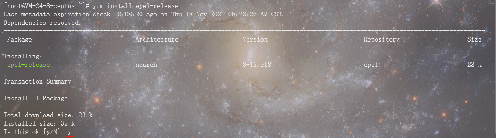
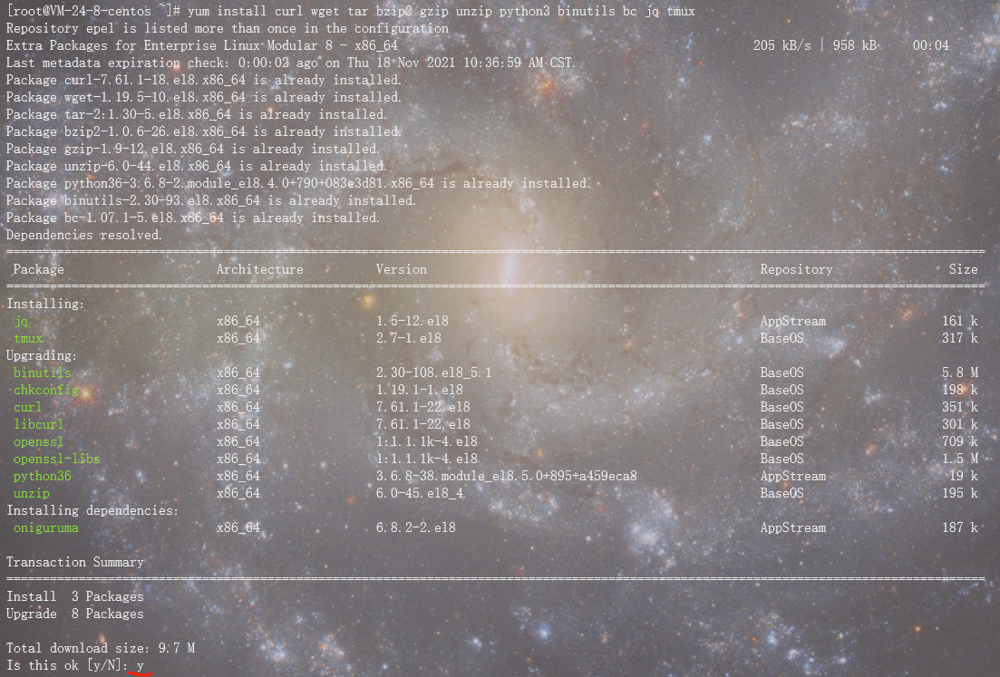
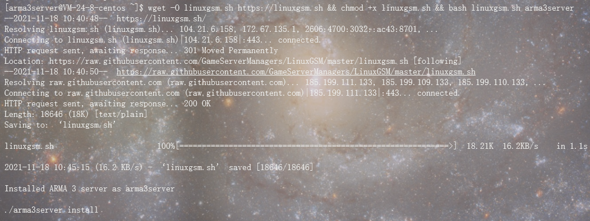

# Centos8 环境下 LinuxGameServerManagers 安装配置 #
> LinuxGameServerManagers 安装需要拥有 `SteamCMD`，如果没有安装 `SteamCMD` 请参考 [SteamCMD](SteamCMD.md) 安装
## 一、所需依赖 ##
### 1、EPEL ###
```shell
yum install epel-release
```

### 2、必备工具 ###
```shell
yum install curl wget tar bzip2 gzip unzip python3 binutils bc jq tmux
```

## 二、安装 ##
### 1、创建用户并登录 ###
#### 创建一个新用户 ####
```shell
useradd arma3server
```
#### 新用户登录 ####
```shell
su - arma3server
```
### 2、下载 ###
```shell
wget -O linuxgsm.sh https://linuxgsm.sh && chmod +x linuxgsm.sh && bash linuxgsm.sh arma3server
```

### 3、运行 arma3server ###
```shell
./arma3server install
```
> 执行此步骤 就要耐心等待，网络慢的问题，不要着急
### 3、添加 Steam 登录详细信息 ###
#### 配置文件 ####
```shell
vim lgsm/config-lgsm/arma3server/common.cfg
```
#### 设置账号密码 ####
```shell
steamuser="username"
steampass="password"
```
### 4、运行安装程序 ####
```shell
./arma3server install
```

