# Centos8 环境下 SteamCMD 安装配置 #
> 本文假设，你知道什么是Linux操作系统，本文所使用的服务器操作系统版本是：  **64位CentOS8** 如果没有 `CentOS` 请 [参考在线安装CentOS-8.2](/Linux/在线安装CentOS-8.2.2004-x86_64.md)
## 一、检查并安装依赖 ##
> 因为 `SteamCMD` 运行在 `32位` 环境，所以 `CentOS8` 需要安装 `32位` 版本的 `glibc`, `libstdc++`
### 1、glibc ###
#### 检查 ####
```shell
yum list glibc
```
> 出现下图显示表示 `glibc` 已安装和可以安装的
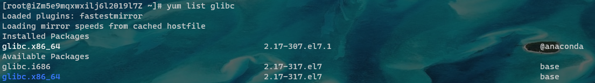
#### 安装 ####
```shell
sudo yum install glibc glibc.i686
```
> 出现下图显示，输入 `y` 继续安装
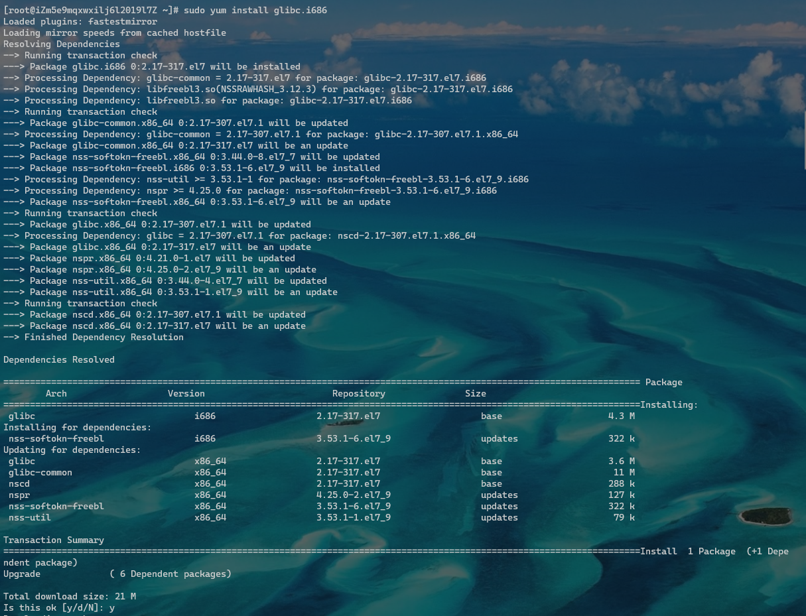
> 出现下图显示，说明安装成功
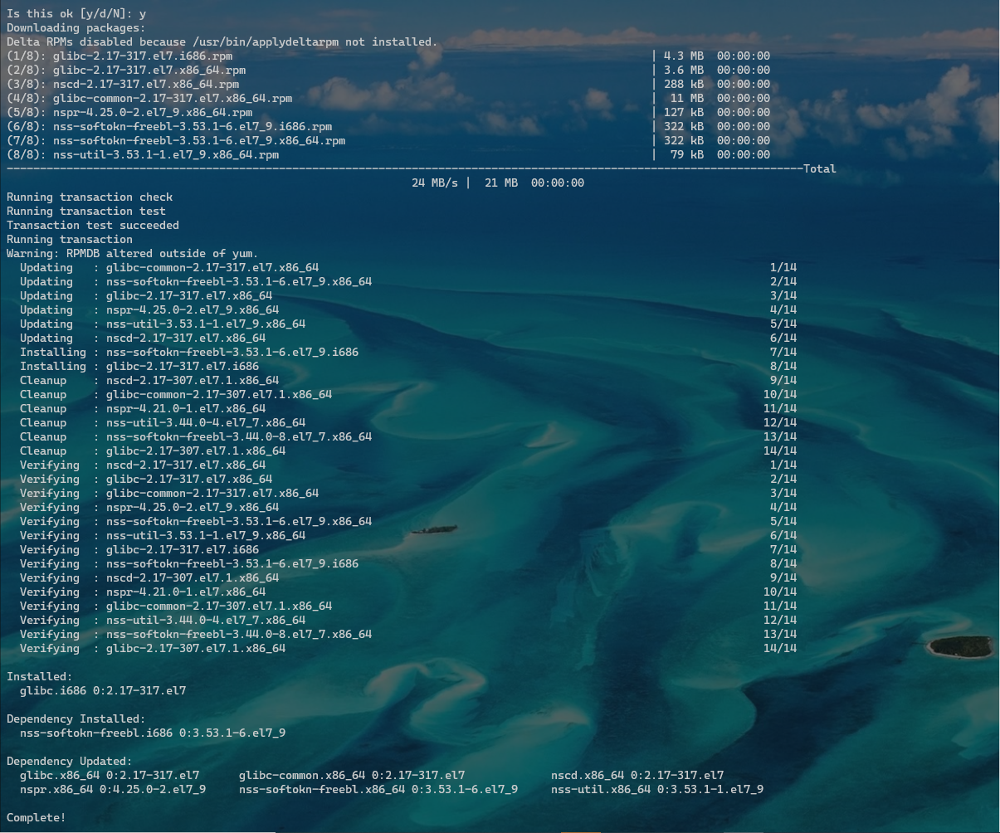
### 2、libstdc++ ###
#### 检查 ####
```shell
yum list libstdc++
```
> 出现下图显示表示，未安装 `libstdc++`
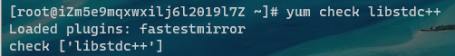
#### 安装 ####
```shell
sudo yum install libstdc++ libstdc++.i686
```
> 出现下图显示，说明安装失败
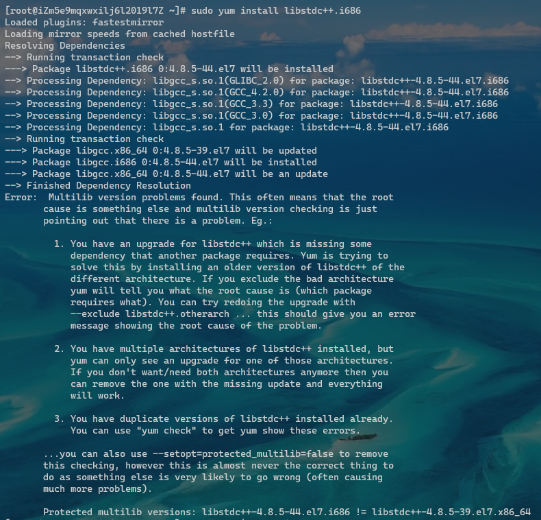
> 出现失败不要惊慌，我们进行如下操作：
```shell
sudo yum install --setopt=protected_multilib=false libstdc++
```
> 出现下图显示，输入 `y` 继续安装，这表示我们的安装时有效的
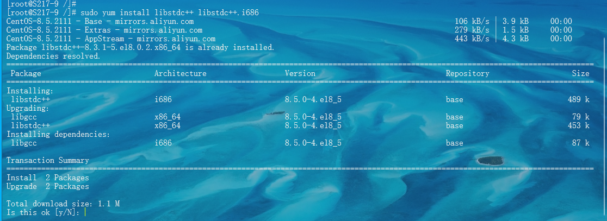
> 出现下图显示，说明安装成功
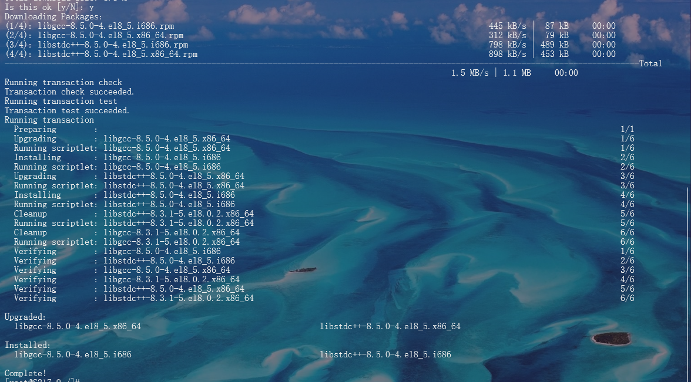
## 二、安装 SteamCMD ##
> 进行到此步骤说明我们已经安装完依赖了，如果不放心可以去在检查一下依赖
### 1、安装前准备
> **依次**执行如下命令，进行 `新建用户`，`创建文件夹`
#### 新建用户 ####
```shell
useradd -m steam
```
#### 切换用户登录 ####
```shell
su - steam
```
#### 创建文件夹 ####
```shell
mkdir ~/Steam && cd ~/Steam
```
### 2、下载 SteamCMD 安装包
> **依次**执行如下命令，进行 `安装包下载`，`安装包解压`，`安装包删除`
#### 安装包下载 ####
```shell
wget https://steamcdn-a.akamaihd.net/client/installer/steamcmd_linux.tar.gz
```
#### 安装包解压 ####
```shell
tar -xvzf steamcmd_linux.tar.gz
```
#### 安装包删除 ####
```shell
rm -f steamcmd_linux.tar.gz
```
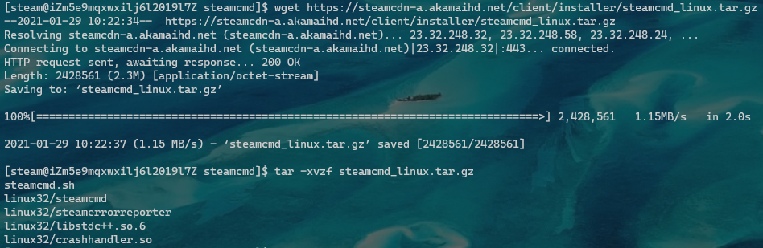
## 三、启动 SteamCMD 并进行配置 ##
### 1、启动 SteamCMD ###
#### 切换到 SteamCMD 安装目录 ####
```shell
cd ~/Steam
```
#### 执行启动 ####
```shell
./steamcmd.sh
```
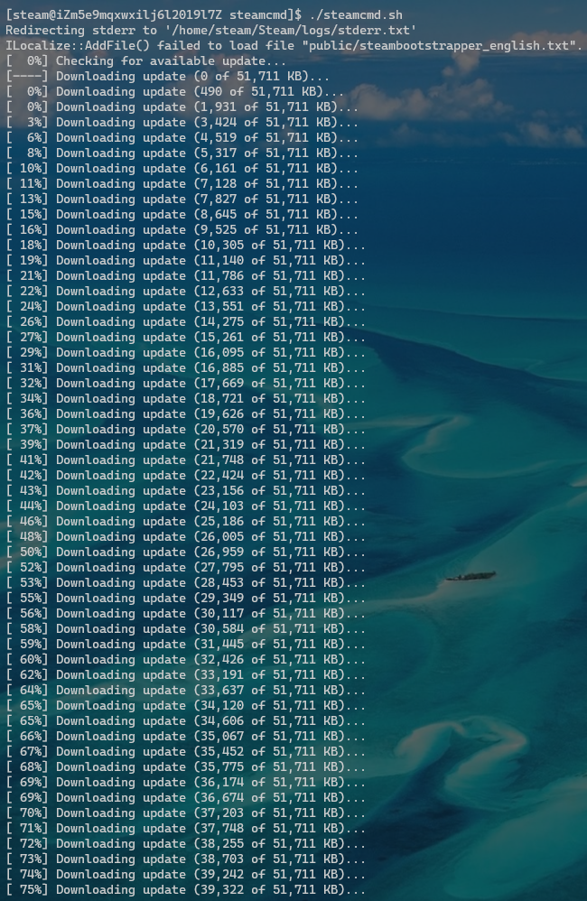
#### 启动完成 ####
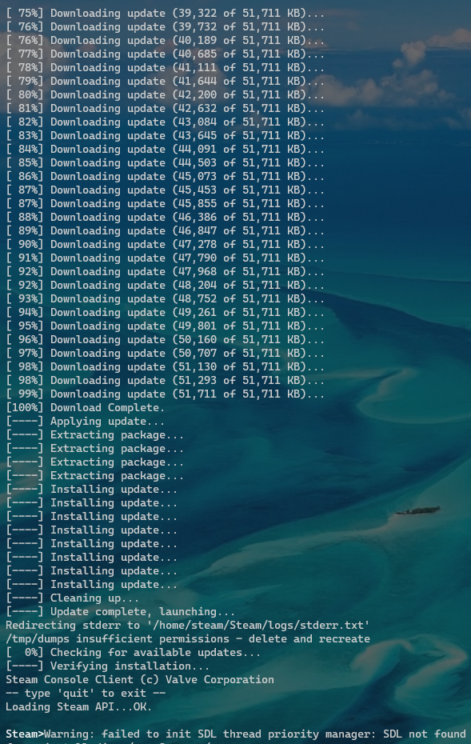
### 2、配置 SteamCMD ### 
#### 1、登录命令： ####
```shell
login 帐号
```
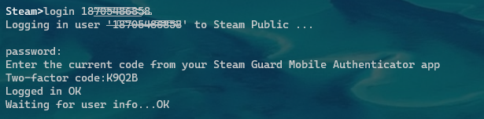
#### 2、下载 Arma3 ####
> [点击查看 APP ID](https://developer.valvesoftware.com/wiki/Dedicated_Servers_List)
```shell
app_update 233780 validate
```