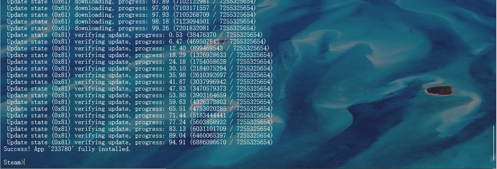

# Centos8 环境下 SteamCMD 安装配置 #
> 本文假设，你知道什么是Linux操作系统，本文所使用的服务器操作系统版本是：  **64位CentOS8** 如果没有 `CentOS` 请 [参考在线安装CentOS-8.2](/Linux/在线安装CentOS-8.2.2004-x86_64.md)
## 一、检查并安装依赖 ##
> 因为 `SteamCMD` 运行在 `32位` 环境，所以 `CentOS8` 需要安装 `32位` 版本的 `glibc`, `libstdc++`
### 1、glibc ###
#### 检查 ####
```shell
yum list glibc
```
> 出现下图显示表示 `glibc` 已安装和可以安装的

#### 安装 ####
```shell
sudo yum install glibc glibc.i686
```
> 出现下图显示，输入 `y` 继续安装

> 出现下图显示，说明安装成功

### 2、libstdc++ ###
#### 检查 ####
```shell
yum list libstdc++
```
> 出现下图显示表示，未安装 `libstdc++`

#### 安装 ####
```shell
sudo yum install libstdc++ libstdc++.i686
```
> 出现下图显示，输入 `y` 继续安装

> 出现下图显示，说明安装成功


#### 安装报错 `安装成功就请忽略下列步骤，直接安装 CMD` ####
> 出现下图显示，说明安装失败


> 出现失败不要惊慌，我们进行如下操作：
```shell
sudo yum install --setopt=protected_multilib=false libstdc++
```
> 出现下图显示，输入 `y` 继续安装，这表示我们的安装时有效的

> 出现下图显示，说明安装成功

## 二、安装 SteamCMD ##
> 进行到此步骤说明我们已经安装完依赖了，如果不放心可以去在检查一下依赖
### 1、安装前准备
> **依次**执行如下命令，进行 `新建用户`，`切换用户`
#### 新建用户 ####
```shell
useradd -m steam
```
#### 切换用户登录 ####
```shell
su - steam
```
### 2、下载 SteamCMD 安装包
> **依次**执行如下命令，进行 `安装包下载`，`安装包解压`，`安装包删除`
#### 安装包下载 ####
```shell
cd ~/ && wget https://steamcdn-a.akamaihd.net/client/installer/steamcmd_linux.tar.gz
```
#### 安装包解压 ####
```shell
tar -xvzf steamcmd_linux.tar.gz
```
#### 安装包删除 ####
```shell
rm -f steamcmd_linux.tar.gz
```

## 三、启动 SteamCMD 并安装 Arma3 Server ##
### 1、启动 SteamCMD ###
#### 切换到 SteamCMD 安装目录 ####
```shell
cd ~/
```
#### 执行启动 ####
```shell
./steamcmd.sh
```

#### 如下图启动完成 ####

### 2、配置 SteamCMD ### 
#### 1、登录命令： ####
```shell
login 帐号
```
> 如下图所示登录：


#### 2、下载 Arma3 Server ####
> [点击查看 APP ID](https://developer.valvesoftware.com/wiki/Dedicated_Servers_List)
```shell
app_update 233780 validate
```
> 出现下图显示，说明安装成功


#### 3、退出 SteamCMD ####
```shell
exit
```
## 四、配置 Arma3 Server ##
#### 1、创建用于存储配置文件和 `Arma3.cfg` 文件的目录 ####
```shell
mkdir -p ~/".local/share/Arma 3" && mkdir -p ~/".local/share/Arma 3 - Other Profiles"
```
// todo
## 五、挂载模组 ##
### 1、创建模组存放文件夹 `mods` ###
#### 1、切换到 Arma 3 Server 目录下 ####
```shell
cd /home/steam/Steam/steamapps/common/Arma\ 3\ Server/
```
#### 2、创建文件夹 ####
```shell
mkdir mods
```
#### 3、使用 `FTP` 工具将下载的模组文件上传到 `mods` 文件夹下 ####
### 2、处理模组小写字母，无空格 ###
> Arma 3 server 要求模组的名字必须是小写字母，不能带空格以及特殊符号， 所以需要使用以下脚本将文件名进行转换
#### 1、在 `mods` 目录新建 `lowercase.sh` 脚本 ####
```shell
cd /home/steam/Steam/steamapps/common/Arma\ 3\ Server/mods/ && vim lowercase.sh
```
#### 2、按一下键盘字母`i`进行编辑，添加以下内容： ####
```shell
#!/bin/bash
depth=0
for x in $(find . -type d | sed "s/[^/]//g")
do
if [ ${depth} -lt ${#x} ]
then
   let depth=${#x}
fi
done
echo "层级是 ${depth}"
for ((i=1;i<=${depth};i++))
do
  for x in $(find . -maxdepth $i | grep [A-Z])
  do
    mv $x $(echo $x | tr 'A-Z' 'a-z')
  done
done
```
#### 3、按一下`esc`键 退出编辑 ####
#### 4、`:wq` 保存退出 ####
#### 5、执行 `lowercase.sh` 脚本 ####
```shell
./lowercase.sh
```
### 3、复制模组的 key 文件 到指定文件夹下 (注意替换 *** 成模组名称) ###
```shell
 mv /home/steam/Steam/steamapps/common/Arma\ 3\ Server/mods/***/keys/ /home/steam/Steam/steamapps/common/Arma\ 3\ Server/keys/
```
## 六、更新 Arma3 Server ##
> 只要 Steam 上发布补丁，就要更新服务器。如果服务器正在运行，则需要先停止服务器。否则直接进行 `三、启动 SteamCMD 并安装 Arma3 Server` 进行更新。
### 1、 停止运行服务器 ### 
// todo

