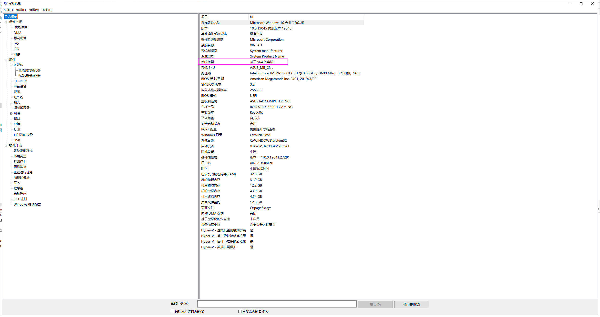
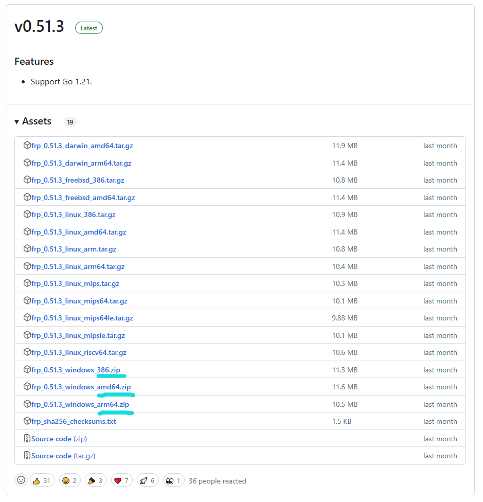
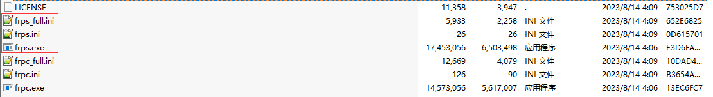
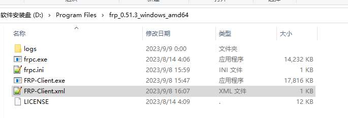
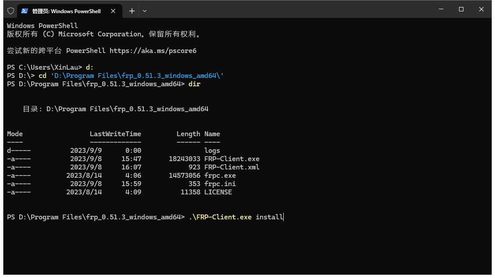
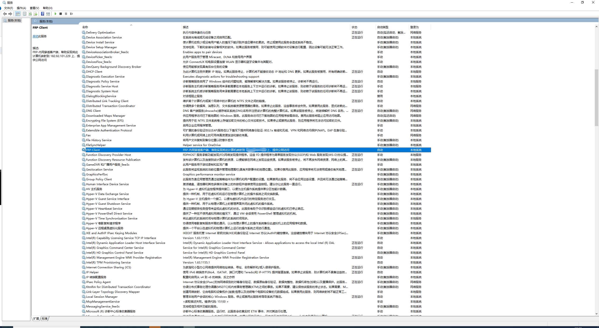

# Windows 环境下 FRP 客户端安装配置 #

### 注意看我的标题！！！！我这是针对 WinSW v0.51.3 版本 amd64的CPU架构 ###

> 软件会调用/执行CMD脚本，并且会将本地端口映射到公网，Windows Defender 可能会报毒，并且自动删除内网穿透主程序，导致无法穿透。
> 可以试图 手动添加白名单，具体操作可根据杀毒软件百度搜索如何加入白名单

## 下载地址：

### 1、查看系统CPU架构

> `Win` 键 + `R` 键 打开运行窗口 输入 `msinfo32` 点击确定 弹出如下窗口



> 查看 红框 所示的 `系统类型` 然后根据下表确认您的系统架构

|  输出   | 对应架构  |
|:-----:|:-----:|
|  x86  | i386  |
|  x64  | amd64 |
| ARM64 | ARM64 |

### 1、根据自己的 `CPU架构` 下载对应版本的 `FRP`



> 下载之后直接解压到想要安装的目录下

[FRP 下载列表](https://github.com/fatedier/frp/releases/download/v0.51.3/frp_0.51.3_windows_amd64.zip)

### 2、删除服务端相关文件

> 删除下图 红框内的 `服务端文件` 保留其他文件



## 配置文件：

> [FRP 客户端 更多参数配置请参考](https://gofrp.org/docs/)

```ini
# [common] 整体部分
[common]
# 服务端地址
server_addr = 0.0.0.0
# 服务端注册端口 
server_port = 7000
# 控制台或真实日志文件路径
log_file = ./frpc.log
# 日志级别 trace, debug, info, warn, error
log_level = info
# 日志保留时间
log_max_days = 3
# 指定使用何种身份验证方法将 客户端 与 服务端 进行身份验证。
authentication_method = token
# 否在发送给 服务端 的心跳中包含身份验证令牌
authenticate_heartbeats = true
# 是否在发送到 服务端 的新工作连接中包含身份验证令牌
authenticate_new_work_conns = true
# token 值 由服务端提供
token = 12345678

# 自定义代理名称
[ssh]
# tcp | udp | http | https | stcp | xtcp
type = tcp
# 需要代理的 本地地址
local_ip = 127.0.0.1
# 需要代理的 本地端口
local_port = 22
# 此代理限制带宽，单位为KB和MB
bandwidth_limit = 1MB
# 限制带宽的位置，可选 'client' 客户端或者 'server' 服务端
bandwidth_limit_mode = client
# 客户端与服务端之间的消息是否加密
use_encryption = false
# 消息是否压缩
use_compression = false
# 服务端 远程端口监听
remote_port = 6001
```

## 注册为系统服务

### 1、[点击下载 WinSW](https://github.com/winsw/winsw/releases/download/v2.12.0/WinSW-x64.exe)

> 下载之后直接放到 `FRP 客户端` 安装目录下 并修改名字为 `FRP-Client.exe`

### 2、新建 WinSW 配置文件 `FRP-Client.xml` 添加如下内容

```xml

<service>
    <!-- 服务ID名称（唯一） -->
    <id>FRP-Client</id>
    <!-- 服务显示名称 -->
    <name>FRP-Client</name>
    <!-- 服务的描述信息 -->
    <description>FRP-内网穿透客户端，帮助实现将此计算机映射到 ***.***.***.*** 上，提供公网访问</description>
    <!-- 可设置环境变量 -->
    <env name="HOME" value="%BASE%"/>
    <!-- 要执行的可执行文件 -->
    <executable>%BASE%\frpc.exe</executable>
    <!-- 可执行文件传递的参数 -->
    <arguments>-c .\frpc.ini</arguments>
    <!-- <logmode>rotate</logmode> -->
    <logpath>%BASE%\logs</logpath>
    <log mode="roll-by-size-time">
        <sizeThreshold>10240</sizeThreshold>
        <pattern>yyyyMMdd</pattern>
        <autoRollAtTime>00:00:00</autoRollAtTime>
        <zipOlderThanNumDays>5</zipOlderThanNumDays>
        <zipDateFormat>yyyyMMdd</zipDateFormat>
    </log>
</service>

```

### 3、最终目录效果如下



### 4、以管理员身份黑窗口执行 `.\FRP-Client.exe install` 注册成为系统服务



### 5、最终效果


