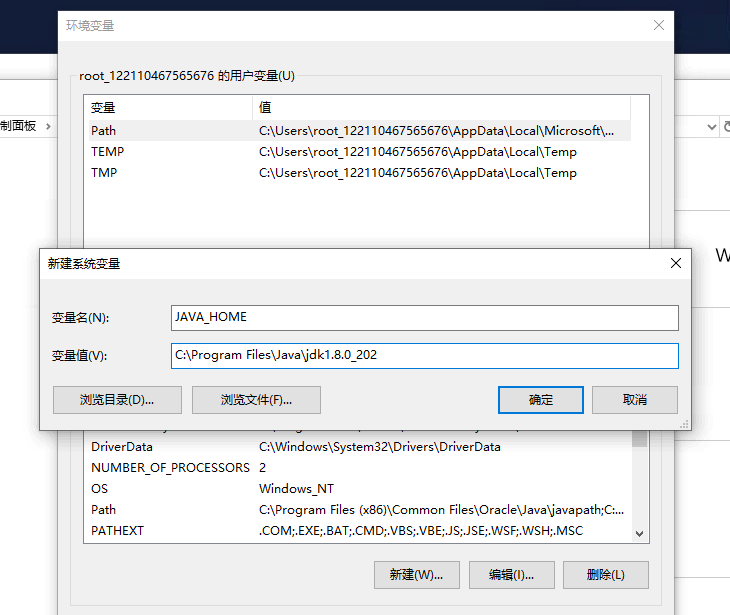
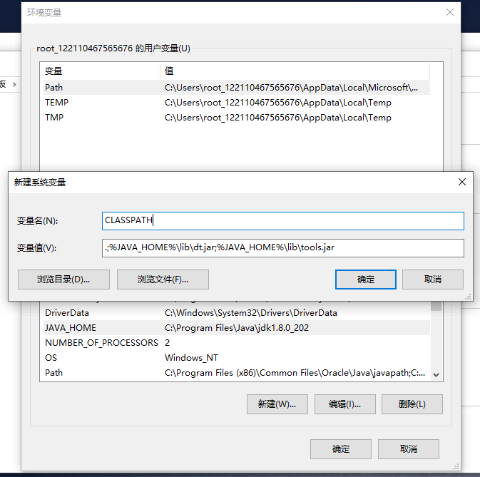
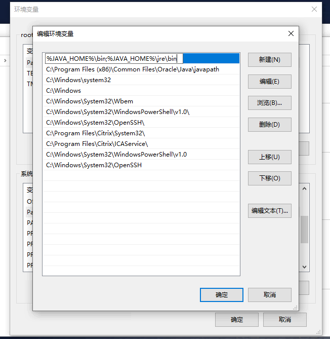
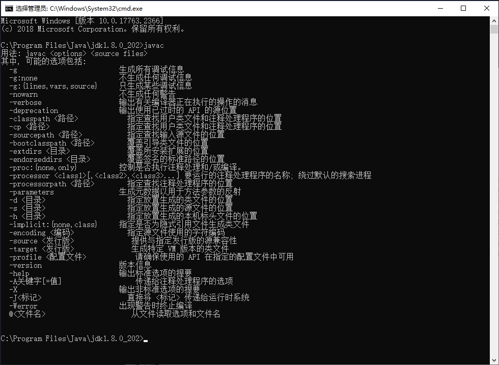

# Windows 环境下 JDK1.8 安装配置 #
### 注意看我的标题！！！！我这是针对1.8版本 ###

> Oracle JDK从2019年4月16号开始商用收费 jdk-8u202 以上的版本商用需要付费

## Java 下载地址：

[JDK 8u202及更早版本](https://www.oracle.com/java/technologies/javase/javase8-archive-downloads.html)

> 下载完成之后 直接右键管理员身份运行 `jdk-8u202-windows-x64.exe`，一直点击下一步直到完成

## Java 环境变量配置：

### 新建环境变量  `JAVA_HOME`

> Java 的安装目录

```
JAVA_HOME
```

```
C:\Program Files\Java\jdk1.8.0_202
```



### 新建环境变量 `CLASSPATH`

```
CLASSPATH
```

```
.;%JAVA_HOME%\lib\dt.jar;%JAVA_HOME%\lib\tools.jar
```



### 修改环境变量 `Path`

> 在最前面添加，千万注意此处，这里配置不对，`javac` 命令会出现 `不是内部或外部命令`的错误

```
Path
```

```
%JAVA_HOME%\bin;%JAVA_HOME%\jre\bin;
```



### 测试

> 黑窗口测试

```
javac
```

