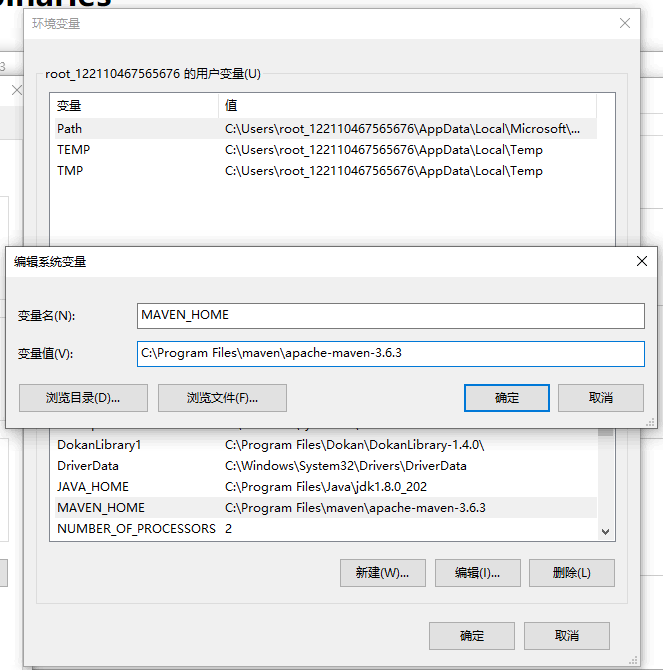
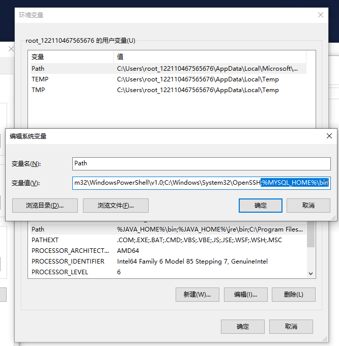
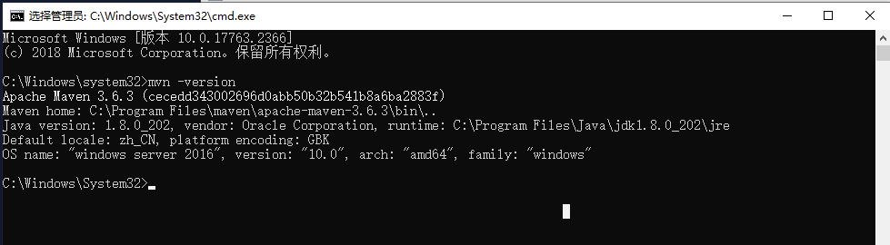

# Windows 环境下 Maven 安装配置 #
### 注意看我的标题！！！！我这是针对3.6.3版本 ###

> Maven 安装需要JDK环境，如果没有安装JDK请参考安装 [JDK配置](/Windows/JDK.md)

## Maven 下载地址：

> 下载之后直接解压到想要安装的目录下

[Maven](https://archive.apache.org/dist/maven/maven-3/)

## Maven 环境变量配置：

### 新建环境变量 `MAVEN_HOME`

```
MAVEN_HOME
```

```
Maven安装目录
```



### 修改环境变量 `Path`

```
Path
```

> 在后追加

```
;%MAVEN_HOME%\bin
```



### 新建环境变量 `MAVEN_OPTS` 配置 Maven 编码格式

```
MAVEN_OPTS
```

```
-Xms256m -Xmx512m -Dfile.encoding=UTF-8
```

## Maven Setting 文件配置

> 直接复制下的内容 覆盖掉 原来的 `apache-maven-x.x.x/conf/setting.xml` 内的内容

### Setting.xml

```xml
<?xml version="1.0" encoding="UTF-8" ?>
 
<!--
Licensed to the Apache Software Foundation (ASF) under one
or more contributor license agreements.  See the NOTICE file
distributed with this work for additional information
regarding copyright ownership.  The ASF licenses this file
to you under the Apache License, Version 2.0 (the
"License"); you may not use this file except in compliance
with the License.  You may obtain a copy of the License at
    http://www.apache.org/licenses/LICENSE-2.0
Unless required by applicable law or agreed to in writing,
software distributed under the License is distributed on an
"AS IS" BASIS, WITHOUT WARRANTIES OR CONDITIONS OF ANY
KIND, either express or implied.  See the License for the
specific language governing permissions and limitations
under the License.
-->
 
<!--
 | This is the configuration file for Maven. It can be specified at two levels:
 | 这是Maven的配置文件,可以在两个级别指定:
 |
 |  1. User Level. 用户级别,这个setting.xml文件为单个用户提供配置，
 |                 并且通常以${user.home}/.m2/settings.xml格式提供。
 |                 
 |                 注意:可以使用CLI选项覆盖此位置    -s /path/to/user/settings.xml
 |
 |                 
 |
 |  2. Global Level. 全球级别，这个setting.xml文件为所有Maven提供配置机器上的用户(假设他们都使用相同的Maven安装)。
 |                   它通常以${maven.home}/conf/settings.xml格式提供。
 |
 |                   注意:可以使用CLI选项覆盖此位置:     -gs /path/to/global/settings.xml
 |
 |                 
 |  本示例文件中的部分旨在让您开始充分利用Maven安装。在适当的情况下，提供默认值(未指定设置时使用的值)。
 |
 |-->
<settings xmlns="http://maven.apache.org/SETTINGS/1.0.0"
          xmlns:xsi="http://www.w3.org/2001/XMLSchema-instance"
          xsi:schemaLocation="http://maven.apache.org/SETTINGS/1.0.0 http://maven.apache.org/xsd/settings-1.0.0.xsd">

    <!-- 本地存储库（localRepository）
     | 本地存储库maven的路径将用于存储工件。
     |
     | 默认: ${user.home}/.m2/repository
    <localRepository>/path/to/local/repo</localRepository>
    -->

    <!--自定义本地仓库路径-->
    <localRepository>D:\MavenRepository</localRepository>

    <!-- 交互模式（interactiveMode）
     | 这将决定maven是否在需要输入时提示您。如果设置为false,maven将使用一个合理的默认值(可能基于其他设置)来处理相关参数。
     |
     | 默认: true
    <interactiveMode>true</interactiveMode>
    -->
 
    <!-- 离线（offline）
     | 确定maven在执行构建时是否应该尝试连接到网络。
     | 这将对工件下载、工件部署和其他方面产生影响。
     |
     | 默认: false
    <offline>false</offline>
    -->
 
    <!-- 插件组（pluginGroups）
     | 这是一个附加的组标识符列表，当通过它们的前缀解析插件时，
     | 例如在调用“mvn prefix:goal”这样的命令行时，将对它们进行搜索。
     | 如果这些还没有包含在列表中，Maven将自动添加组标识符“org.apache.maven.plugins”和“org.codehaus.mojo”。
     |-->
    <pluginGroups>
        <!-- 插件组（pluginGroup）
         | 指定用于插件查找的进一步组标识符。
        <pluginGroup>com.your.plugins</pluginGroup>
        -->
    </pluginGroups>
 
    <!-- 代理列表（proxies）
     | 这是一个可以在此机器上使用的代理列表，以连接到网络。
     | 除非另有规定(由系统属性或命令行开关指定)，否则将使用此列表中标记为活动的第一个代理规范。
     |-->
    <proxies>
        <!-- 代理（proxy）
         | 用于连接网络的一个代理的规范。
         |
        <proxy>
          <id>optional</id>
          <active>true</active>
          <protocol>http</protocol>
          <username>proxyuser</username>
          <password>proxypass</password>
          <host>proxy.host.net</host>
          <port>80</port>
          <nonProxyHosts>local.net|some.host.com</nonProxyHosts>
        </proxy>
        -->
    </proxies>
 
    <!-- 服务器列表（servers）
     | 这是一个身份验证配置文件列表，由系统中使用的服务器id键入。
     | 当maven必须连接到远程服务器时，可以使用身份验证配置文件。
     |-->
    <servers>
        <!-- 服务器（server）
         | 指定连接到特定服务器时要使用的身份验证信息，该信息由系统中的唯一名称标识(下面的“id”属性引用)。
         |
         | 注意:您应该指定用户名（username）密码（password）或者私钥（privateKey）密码（passphrase），因为这些配对是一起使用的。
        -->

        <!-- 第一种示例，使用用户名、密码进行身份验证 -->
        <!--
        <server>
          <id>deploymentRepo</id>
          <username>repouser</username>
          <password>repopwd</password>
        </server>
        -->
 
        <!-- 第二种示例，使用私钥、密码进行身份验证 -->
        <!--
        <server>
          <id>siteServer</id>
          <privateKey>/path/to/private/key</privateKey>
          <passphrase>optional; leave empty if not used.</passphrase>
        </server>
        -->
    </servers>
 
    <!-- 镜像列表（mirrors）
     | 这是用于从远程存储库下载工件的镜像列表。
     |
     | 它的工作原理是这样的:POM可以声明存储库以用于解析某些工件。
     | 然而，这个存储库有时可能会遇到大量流量的问题，因此人们将它镜像到多个地方。
     |
     | 该存储库定义将具有唯一的id，因此我们可以为该存储库创建一个镜像引用，用作替代下载站点。镜像站点将是该存储库的首选服务器。
     |-->
    <mirrors>
        <!-- 镜像（mirror）
         | 指定要使用的存储库镜像站点，而不是给定的存储库。此镜像服务的存储库具有与此镜像的mirrorOf元素相匹配的ID。IDs用于继承和直接查找目的，并且必须是唯一的。
         |
        -->

        <!--
        <mirror>
          <id>mirrorId</id>
          <mirrorOf>repositoryId</mirrorOf>
          <name>Human Readable Name for this Mirror.</name>
          <url>http://my.repository.com/repo/path</url>
        </mirror>
         -->
 
        <!-- 阿里云Maven库 -->
        <mirror>
            <id>alimaven-central</id>
            <mirrorOf>central</mirrorOf>
            <name>aliyun maven</name>
            <url>http://maven.aliyun.com/nexus/content/repositories/central/</url>
        </mirror>
        <mirror>
            <id>jboss-public-repository-group</id>
            <mirrorOf>central</mirrorOf>
            <name>JBoss Public Repository Group</name>
            <url>http://repository.jboss.org/nexus/content/groups/public</url>
        </mirror>
 
        <!--<mirror>
            <id>alimaven</id>
            <name>aliyun maven</name>
            <url>http://maven.aliyun.com/nexus/content/groups/public/</url>
            <mirrorOf>central</mirrorOf>
        </mirror>
        <mirror>
            <id>ibiblio</id>
            <mirrorOf>central</mirrorOf>
            <name>Human Readable Name for this Mirror.</name>
            <url>http://mirrors.ibiblio.org/pub/mirrors/maven2/</url>
        </mirror>
        <mirror>
            <id>central</id>
            <name>Maven Repository Switchboard</name>
            <url>http://repo1.maven.org/maven2/</url>
            <mirrorOf>central</mirrorOf>
        </mirror>
        <mirror>
            <id>repo2</id>
            <mirrorOf>central</mirrorOf>
            <name>Human Readable Name for this Mirror.</name>
            <url>http://repo2.maven.org/maven2/</url>
        </mirror>-->
 
    </mirrors>
 
    <!-- 配置文件（profiles）
     | This is a list of profiles which can be activated in a variety of ways, and which can modify
     | the build process. Profiles provided in the settings.xml are intended to provide local machine-
     | specific paths and repository locations which allow the build to work in the local environment.
     |
     | For example, if you have an integration testing plugin - like cactus - that needs to know where
     | your Tomcat instance is installed, you can provide a variable here such that the variable is
     | dereferenced during the build process to configure the cactus plugin.
     |
     | As noted above, profiles can be activated in a variety of ways. One way - the activeProfiles
     | section of this document (settings.xml) - will be discussed later. Another way essentially
     | relies on the detection of a system property, either matching a particular value for the property,
     | or merely testing its existence. Profiles can also be activated by JDK version prefix, where a
     | value of '1.4' might activate a profile when the build is executed on a JDK version of '1.4.2_07'.
     | Finally, the list of active profiles can be specified directly from the command line.
     |
     | NOTE: For profiles defined in the settings.xml, you are restricted to specifying only artifact
     |       repositories, plugin repositories, and free-form properties to be used as configuration
     |       variables for plugins in the POM.
     |
     |-->
    <profiles>
        <!-- profile
         | Specifies a set of introductions to the build process, to be activated using one or more of the
         | mechanisms described above. For inheritance purposes, and to activate profiles via <activatedProfiles/>
         | or the command line, profiles have to have an ID that is unique.
         |
         | An encouraged best practice for profile identification is to use a consistent naming convention
         | for profiles, such as 'env-dev', 'env-test', 'env-production', 'user-jdcasey', 'user-brett', etc.
         | This will make it more intuitive to understand what the set of introduced profiles is attempting
         | to accomplish, particularly when you only have a list of profile id's for debug.
         |
         | This profile example uses the JDK version to trigger activation, and provides a JDK-specific repo.
        <profile>
          <id>jdk-1.4</id>
          <activation>
            <jdk>1.4</jdk>
          </activation>
          <repositories>
            <repository>
              <id>jdk14</id>
              <name>Repository for JDK 1.4 builds</name>
              <url>http://www.myhost.com/maven/jdk14</url>
              <layout>default</layout>
              <snapshotPolicy>always</snapshotPolicy>
            </repository>
          </repositories>
        </profile>
        -->
        <profile>
            <id>jdk18</id>
            <activation>
                <jdk>1.8</jdk>
                <activeByDefault>true</activeByDefault>
            </activation>
            <properties>
                <maven.compiler.source>1.8</maven.compiler.source>
                <maven.compiler.target>1.8</maven.compiler.target>
                <maven.compiler.compilerVersion>1.8</maven.compiler.compilerVersion>
            </properties>
        </profile>
 
        <!--
         | Here is another profile, activated by the system property 'target-env' with a value of 'dev',
         | which provides a specific path to the Tomcat instance. To use this, your plugin configuration
         | might hypothetically look like:
         |
         | ...
         | <plugin>
         |   <groupId>org.myco.myplugins</groupId>
         |   <artifactId>myplugin</artifactId>
         |
         |   <configuration>
         |     <tomcatLocation>${tomcatPath}</tomcatLocation>
         |   </configuration>
         | </plugin>
         | ...
         |
         | NOTE: If you just wanted to inject this configuration whenever someone set 'target-env' to
         |       anything, you could just leave off the <value/> inside the activation-property.
         |
        <profile>
          <id>env-dev</id>
          <activation>
            <property>
              <name>target-env</name>
              <value>dev</value>
            </property>
          </activation>
          <properties>
            <tomcatPath>/path/to/tomcat/instance</tomcatPath>
          </properties>
        </profile>
        -->
    </profiles>
 
    <!-- activeProfiles
     | List of profiles that are active for all builds.
     |
    <activeProfiles>
      <activeProfile>alwaysActiveProfile</activeProfile>
      <activeProfile>anotherAlwaysActiveProfile</activeProfile>
    </activeProfiles>
    -->
</settings>
 
```

## 验证

``
mvn -version
``



## 手动导入Jar包

> 黑窗口进入Maven的bin的文件夹下,运行如下代码

```
mvn install:install-file -Dfile=[jar包的位置] -DgroupId=[pom文件的groupId标签] -DartifactId={pom文件的artifactId标签} -Dversion=[pom文件的version标签] -Dpackaging=jar -DgeneratePom=true -DcreateChecksum=true
```

#### 例如

>jbarcode-0.2.8.jar

```
<dependency>
	<groupId>org.jbarcode</groupId>
	<artifactId>jbarcode</artifactId>
	<version>0.2.8</version>
</dependency>
```

> 执行

```
mvn install:install-file -Dfile=C:\Users\liuxin\Desktop\jbarcode-0.2.8.jar -DgroupId=org.jbarcode -DartifactId=jbarcode -Dversion=0.2.8 -Dpackaging=jar -DgeneratePom=true -DcreateChecksum=true
```


