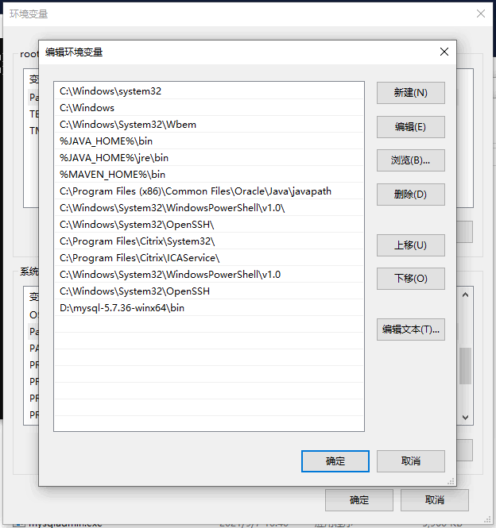
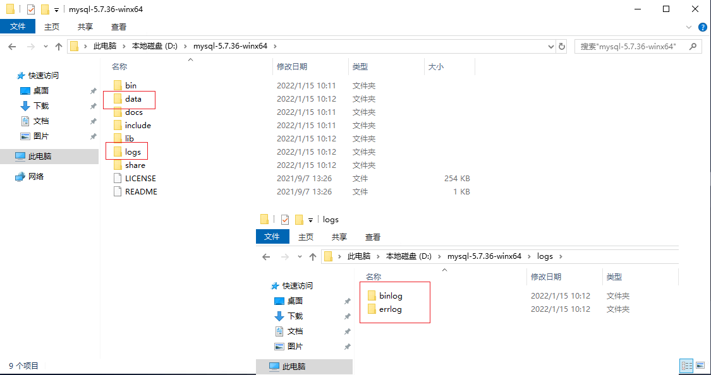

# Windows 环境下 MySQL Community Server 8.4.5 LTS 安装配置 #

### 注意看我的标题！！！！我这是针对 [MySQL Community Server 8.4.5 LTS 版本](https://cdn.mysql.com//Downloads/MySQL-8.4/mysql-8.4.5-winx64.zip) ###

[版本查询地址一](https://dev.mysql.com/downloads/mysql/)

[版本查询地址二](https://downloads.mysql.com/archives/community/)

## MySQL 下载地址：

[MySQL Community Server 8.4.5 LTS](https://cdn.mysql.com//Downloads/MySQL-8.4/mysql-8.4.5-winx64.zip)


> 下载完成之后 直接复制解压到 `D` 盘下

## 配置 MySQL

### 修改环境变量 `Path`

```
Path
```

> 在后追加

```
;D:\mysql-8.4.5-winx64\bin
```



### 完善 MySQL 目录

> 在安装目录下分别创建文件夹 `data`， `logs`; 在 `logs` 下分别创建两个名为 `binlog`, `errlog` 的文件夹



### 创建 `my.ini` 配置文件 编辑 `my.ini` 配置以下基本信息：

> ##### 参考：（注意修改：`basedir` `datadir` `server-id` `log-bin` `log-error` `binlog-do-db`） #####

```ini
## 数据库基本配置 ##

[mysql]
# 添加默认字符集参数
default-character-set = UTF8MB4
# 修改MYSQL端口号，默认为3306，建议不要用默认的，请配置为其他端口号，例如：3369、6033等
port = 3306

[client]
# 添加默认字符集参数
default-character-set = UTF8MB4
# 修改MYSQL端口号，默认为3306，建议不要用默认的，请配置为其他端口号，例如：3369、6033等
port = 3306

[mysqld]
# 设置端口
port = 6033
# 设置 MySQL 的安装目录
basedir = D:\\mysql-8.4.5-winx64
# 设置 MySQL 数据库的数据的存放目录
datadir = D:\\mysql-8.4.5-winx64\\data
# 允许最大连接数
#max_connections = 200
# 配置允许连接失败的次数。这是为了防止有人从该主机试图攻击数据库系统
max_connect_errors = 10
# 配置 MySQL 在关闭一个非交互的连接之前所要等待的秒数，其取值范围为1-2147483(Windows)，1-31536000(linux)，默认值28800。
#wait_timeout = 31536000
# 配置 MySQL 在关闭一个交互的连接之前所要等待的秒数(交互连接如mysql gui tool中的连接)，其取值范围随wait_timeout变动，默认值28800。
#interactive_timeout = 31536000
# 服务端使用的字符集默认为8比特编码的latin1字符集
character-set-server = UTF8MB4
# 字符集的校对规则
collation-server = utf8mb4_general_ci
# 创建新表时将使用的默认存储引擎
default-storage-engine=INNODB
# 创建模式
sql_mode = NO_ENGINE_SUBSTITUTION,STRICT_TRANS_TABLES
# 此配置是在8.4以下的版本中的配置方法，8.4无此项
#default_authentication_plugin = mysql_native_password
# MySQL8.4版本及以上添加，启用验证密码插件（非8.4及以上无需添加）
mysql_native_password=ON

## 数据库主从搭建配置 ##

# 服务器标志号，注意在配置文件中不能出现多个这样的标识，如果出现多个的话 MySQL 以第一个为准，一组主从中此标识号不能重复。
server-id = 1
# 开启bin-log，并指定文件目录和文件名前缀。
log-bin = D:\\mysql-8.4.5-winx64\\logs\\binlog\\bin-log
# 错误日志存放路径
log-error = D:\\mysql-8.4.5-winx64\\logs\\errlog\\master-error.log
# 每个bin-log最大大小，当此大小等于500M时会自动生成一个新的日志文件。一条记录不会写在2个日志文件中，所以有时日志文件会超过此大小。
max_binlog_size = 500M
# 日志缓存大小
binlog_cache_size = 128K
# 需要同步的数据库名字，如果是多个，就以此格式在写一行即可。
#binlog-do-db = database_test
# 不需要同步的数据库名字，如果是多个，就以此格式在写一行即可。（binlog-do-db,binlog-ignore-db 为互斥关系，只需设置其中一项即可）
binlog-ignore-db = mysql,information_schema,performance_schema,sys
# 当Slave从Master数据库读取日志时更新新写入日志中，如果只启动log-bin 而没有启动log-slave-updates则Slave（从）只记录针对自己数据库操作的更新。
log-slave-updates
# 设置bin-log日志文件格式为：MIXED，可以防止主键重复。
binlog_format = "MIXED"
# 解除bin-log限制存储函数的创建、修改、调用
#log_bin_trust_function_creators = 1
# 时区
default-time-zone = '+8:00'
```

## 启动数据库

### 初始化 MySQL

> 以管理员身份打开 cmd 命令行工具，切换目录：

```shell
cd /dD:\mysql-8.4.5-winx64\bin\
```

> 初始化数据库并配置大小写不敏感：

```shell
mysqld --initialize --user=root --lower-case-table-names=1 --console
```
> 此处注意记录 打印在控制台的 `密码` ，切记一定要记录下来留作后用


### 安装 MySQL

```shell
mysqld install MySQL_8_4_5 --defaults-file="D:\mysql-8.4.5-winx64\my.ini"
```

### 启动 MySQL

```shell
net start MySQL_8_4_5
```

> 更新服务描述

```shell
sc description 服务名称 "服务描述"
```

## 配置用户密码及权限

> root 用户的密码就是前面初始化数据库 打印在控制台并记录下来的密码

### 登录用户

> 当 MySQL 服务已经运行时, 我们可以通过 MySQL 自带的客户端工具登录到 MySQL 数据库中, 首先打开命令提示符, 输入以下格式的命名:

```shell
mysql -h 主机名 -P 端口号 -u 用户名 -p
```

- -h : 指定客户端所要登录的 MySQL 主机名, 登录本机(localhost 或 127.0.0.1)该参数可以省略；
- -P : 指定端口号码；
- -u : 登录的用户名；
- -p : 告诉服务器将会使用一个密码来登录, 如果所要登录的用户名密码为空, 可以忽略此选项。

> 按回车确认, 如果安装正确且 MySQL 正在运行, 会得到以下响应:

```shell
Enter password:
```

> 输入前面记录的密码进入数据库控制台


### 修改密码（操作二选一）

> A 不指定密码插件

```sql
ALTER USER 'root'@'localhost' IDENTIFIED BY '新密码';
FLUSH PRIVILEGES;
```

> B 指定密码插件

```sql
ALTER USER 'root'@'localhost' IDENTIFIED WITH mysql_native_password by '新密码';
FLUSH PRIVILEGES;
```

> 连接权限数据库表

```sql
use mysql;
```

### 授予数据库权限（可选操作）

> 授予特定数据库的只读权限

```sql
GRANT SELECT ON 数据库名.* TO '数据库用户'@'%';
FLUSH PRIVILEGES;
```

> 授予特定数据库的所有权限

```sql
GRANT ALL PRIVILEGES ON 数据库名.* TO '数据库用户'@'%';
FLUSH PRIVILEGES;
```

> 授予所有数据库的所有权限

```sql
GRANT ALL PRIVILEGES ON *.* TO '数据库用户'@'%' WITH GRANT OPTION;
FLUSH PRIVILEGES;
```

### 退出登录

> 修改完成 退出 `quit`。 再次进入时，就可以使用用户名root和刚才设置的新密码登录。

```shell
quit;
```

## 登录测试

> 当 MySQL 服务已经运行时, 我们可以通过 MySQL 自带的客户端工具登录到 MySQL 数据库中, 首先打开命令提示符, 输入以下格式的命名:

```shell
mysql -h 主机名 -P 端口号 -u 用户名 -p
```

- -h : 指定客户端所要登录的 MySQL 主机名, 登录本机(localhost 或 127.0.0.1)该参数可以省略；
- -P : 指定端口号码；
- -u : 登录的用户名；
- -p : 告诉服务器将会使用一个密码来登录, 如果所要登录的用户名密码为空, 可以忽略此选项。

> 按回车确认, 如果安装正确且 MySQL 正在运行, 会得到以下响应:

```shell
Enter password:
```