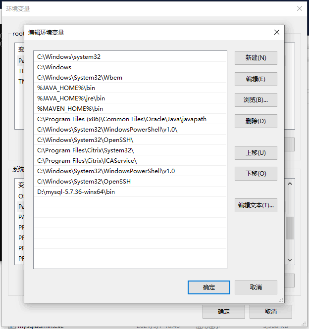
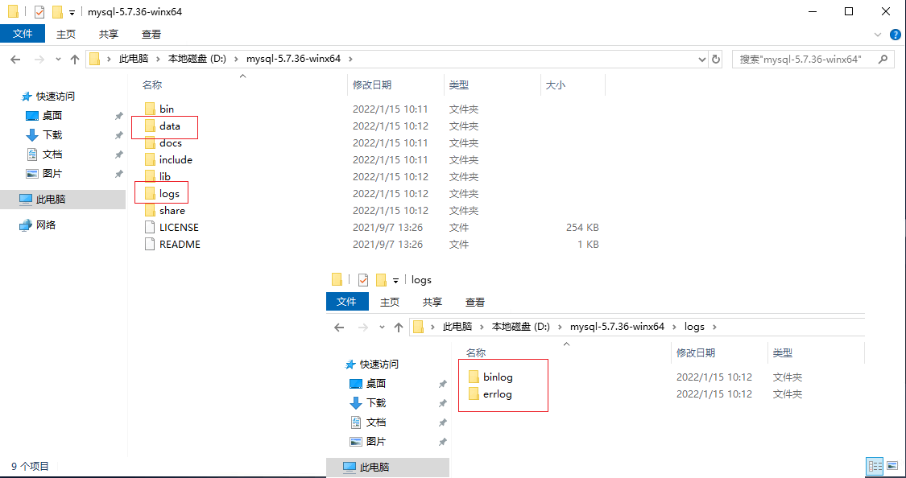
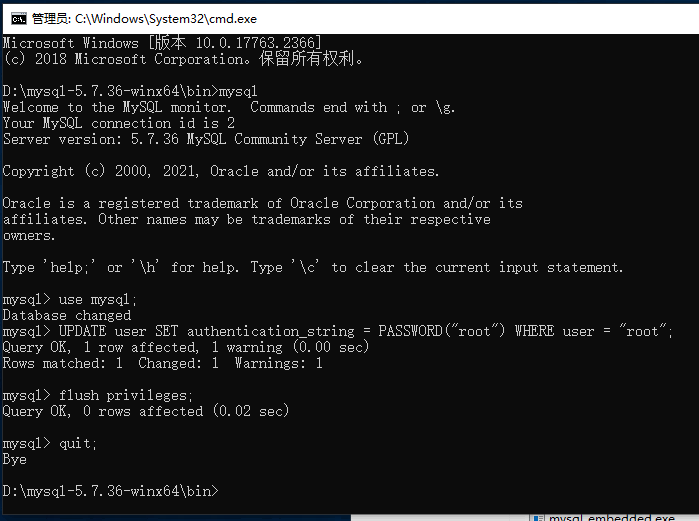
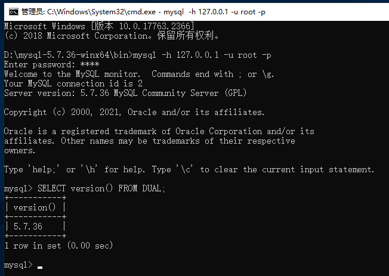

# Windows 环境下 MySQL5.7.36 安装配置 #
### 注意看我的标题！！！！我这是针对5.7.36版本 ###

## MySQL 下载地址：

[MySQL5.7.36](https://dev.mysql.com/downloads/file/?id=507350)


> 下载完成之后 直接解压到安装目录下

## 配置 MySQL

### 修改环境变量 `Path`

```
Path
```

> 在后追加

```
;D:\mysql-5.7.36-winx64\bin
```



### 完善 MySQL 目录

> 在安装目录下分别创建文件夹 `data`， `logs`; 在 `logs` 下分别创建两个名为 `binlog`, `errlog` 的文件夹



### 创建 `my.ini` 配置文件 编辑 `my.ini` 配置以下基本信息：

> ##### 参考：（注意修改：`basedir` `datadir` `server-id` `log-bin` `log-error` `binlog-do-db`） #####

```ini
# For advice on how to change settings please see
# http://dev.mysql.com/doc/refman/5.6/en/server-configuration-defaults.html
# *** DO NOT EDIT THIS FILE. It's a template which will be copied to the
# *** default location during install, and will be replaced if you
# *** upgrade to a newer version of MySQL.

[mysqld]

# Remove leading # and set to the amount of RAM for the most important data
# cache in MySQL. Start at 70% of total RAM for dedicated server, else 10%.
# innodb_buffer_pool_size = 128M

# Remove leading # to turn on a very important data integrity option: logging
# changes to the binary log between backups.
# log_bin

# These are commonly set, remove the # and set as required.
# 配置MYSQL安装目录
basedir = D:\\mysql-5.7.36-winx64
# 配置MYSQL存储数据DATA目录
datadir = D:\\mysql-5.7.36-winx64\data
# 配置端口
port = 3306
# 配置允许最大连接数
#max_connections = 100
# 配置允许连接失败的次数。这是为了防止有人从该主机试图攻击数据库系统
max_connect_errors = 10
# 配置mysql在关闭一个非交互的连接之前所要等待的秒数，其取值范围为1-2147483(Windows)，1-31536000(linux)，默认值28800。
#wait_timeout = 31536000
# 配置mysql在关闭一个交互的连接之前所要等待的秒数(交互连接如mysql gui tool中的连接)，其取值范围随wait_timeout变动，默认值28800。
#interactive_timeout = 31536000
# 添加默认数据引擎项
default-storage-engine = InnoDB
# 添加字符集参数
character-set-server = utf8
# 添加不区分表/字段大小写项
lower_case_table_names = 1

# 服务器标志号，注意在配置文件中不能出现多个这样的标识，如果出现多个的话mysql以第一个为准，一组主从中此标识号不能重复。
server-id = 1
# 开启bin-log，并指定文件目录和文件名前缀。
log-bin = D:\\mysql-5.7.36-winx64\\logs\\binlog\\bin-log
# 错误日志存放路径
log-error = D:\\mysql-5.7.36-winx64\\logs\\errlog\\master-error.log
# 每个bin-log最大大小，当此大小等于500M时会自动生成一个新的日志文件。一条记录不会写在2个日志文件中，所以有时日志文件会超过此大小。
max_binlog_size = 500M
# 日志缓存大小
binlog_cache_size = 128K
# 需要同步的数据库名字，如果是多个，就以此格式在写一行即可。
#binlog-do-db = database_test
# 不需要同步的数据库名字，如果是多个，就以此格式在写一行即可。（binlog-do-db,binlog-ignore-db 为互斥关系，只需设置其中一项即可）
binlog-ignore-db = mysql,information_schema,performance_schema,sys
# 当Slave从Master数据库读取日志时更新新写入日志中，如果只启动log-bin 而没有启动log-slave-updates则Slave（从）只记录针对自己数据库操作的更新。
log-slave-updates
# 设置bin-log日志文件格式为：MIXED，可以防止主键重复。
binlog_format = "MIXED"
# 解除bin-log限制存储函数的创建、修改、调用
#log_bin_trust_function_creators = 1
# 时区
default-time-zone = '+8:00'

sql_mode = NO_ENGINE_SUBSTITUTION,STRICT_TRANS_TABLES

# 绕过所有的权限验证
#skip_grant_tables

[mysql]
# 添加默认字符集参数
default-character-set = utf8
# 修改MYSQL端口号，默认为3306，建议不要用默认的，请配置为其他端口号，例如：3369、6033等
port = 3306

[client]
# 添加默认字符集参数
default-character-set = utf8
# 修改MYSQL端口号，默认为3306，建议不要用默认的，请配置为其他端口号，例如：3369、6033等
port = 3306

# Remove leading # to set options mainly useful for reporting servers.
# The server defaults are faster for transactions and fast SELECTs.
# Adjust sizes as needed, experiment to find the optimal values.
# join_buffer_size = 128M
# sort_buffer_size = 2M
# read_rnd_buffer_size = 2M
```

## 初始化 MySQL

> 以管理员身份打开 cmd 命令行工具，切换目录：

```shell
cd D:\mysql-5.7.36-winx64\bin\
```

> 初始化数据库：

```shell
mysqld --initialize-insecure --console
```

## 安装 MySQL

```shell
mysqld install
```

## 配置 root 用户密码

```shell
mysqld --skip-grant-tables
```

> 连接 MySQL: 再开一个CMD命令行窗口（因为刚才那个DOS窗口已经不能动了），并转到 `D:\mysql-5.7.36-winx64\bin\` 目录，输入 `mysql` 回车，如果成功，将出现MySQL提示符界面

```shell
mysql
```

> 连接权限数据库表

```sql
use mysql;
```

> 改密码

```sql
UPDATE user SET authentication_string = PASSWORD("root") WHERE user = "root";
```

> 刷新权限

```sql
flush privileges;
```

> 修改完成 退出 `quit`。 再次进入时，就可以使用用户名root和刚才设置的新密码登录。

```shell
quit;
```


## 登录测试

> 当 MySQL 服务已经运行时, 我们可以通过 MySQL 自带的客户端工具登录到 MySQL 数据库中, 首先打开命令提示符, 输入以下格式的命名:

```shell
mysql -h 主机名 -u 用户名 -p
```

- -h : 指定客户端所要登录的 MySQL 主机名, 登录本机(localhost 或 127.0.0.1)该参数可以省略;
- -u : 登录的用户名;
- -p : 告诉服务器将会使用一个密码来登录, 如果所要登录的用户名密码为空, 可以忽略此选项。

> 按回车确认, 如果安装正确且 MySQL 正在运行, 会得到以下响应:

```shell
Enter password:
```

