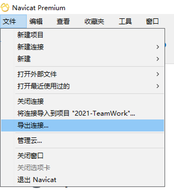
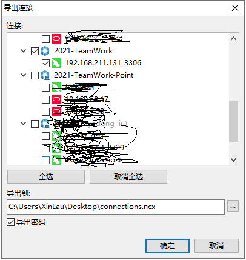
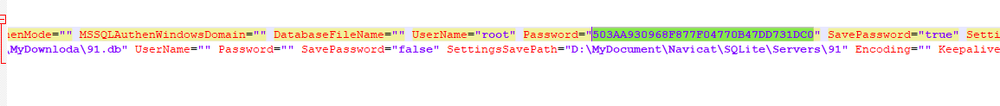
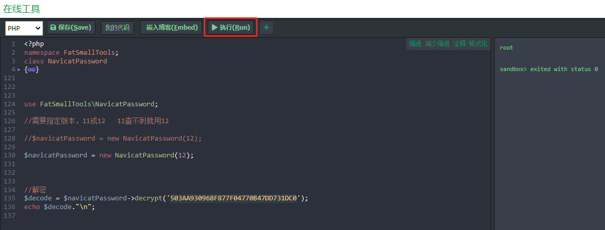

# Navicat Premium 中记录的密码破解

#### 该方法是建立在 Navicat Premium 确实记录 链接密码的 前提下

> 亲测支持 Navicat Premium 16 （16.0.9 其他版本自测）

## 使用方式：

### 1、导出链接，导出连接获取到 `connections.ncx` 文件



> 谨记 一定要勾选 `导出密码` 不然导出的文件里不包含加密的密码



### 2、找到加密密码

> 在导出的 `connections.ncx` 文件中找到 `Password`，然后复制出来



### 3、进行破解

#### 1️⃣ 打开 [网址](https://tool.lu/coderunner)

#### 2️⃣ 复制以下 `PHP` 解密代码 到 刚才打开的那个网址

```php
<?php
namespace FatSmallTools;
class NavicatPassword
{
    protected $version = 0;
    protected $aesKey = 'libcckeylibcckey';
    protected $aesIv = 'libcciv libcciv ';
    protected $blowString = '3DC5CA39';
    protected $blowKey = null;
    protected $blowIv = null;
    public function __construct($version = 12)
    {
        $this->version = $version;
        $this->blowKey = sha1('3DC5CA39', true);
        $this->blowIv = hex2bin('d9c7c3c8870d64bd');
    }
    public function encrypt($string)
    {
        $result = FALSE;
        switch ($this->version) {
            case 11:
                $result = $this->encryptEleven($string);
                break;
            case 12:
                $result = $this->encryptTwelve($string);
                break;
            default:
                break;
        }
        return $result;
    }
    protected function encryptEleven($string)
    {
        $round = intval(floor(strlen($string) / 8));
        $leftLength = strlen($string) % 8;
        $result = '';
        $currentVector = $this->blowIv;
        for ($i = 0; $i < $round; $i++) {
            $temp = $this->encryptBlock($this->xorBytes(substr($string, 8 * $i, 8), $currentVector));
            $currentVector = $this->xorBytes($currentVector, $temp);
            $result .= $temp;
        }
        if ($leftLength) {
            $currentVector = $this->encryptBlock($currentVector);
            $result .= $this->xorBytes(substr($string, 8 * $i, $leftLength), $currentVector);
        }

        return strtoupper(bin2hex($result));

    }

    protected function encryptBlock($block)
    {
        return openssl_encrypt($block, 'BF-ECB', $this->blowKey, OPENSSL_RAW_DATA|OPENSSL_NO_PADDING); 
    }

    protected function decryptBlock($block)
    {
        return openssl_decrypt($block, 'BF-ECB', $this->blowKey, OPENSSL_RAW_DATA|OPENSSL_NO_PADDING); 
    }

    protected function xorBytes($str1, $str2)
    {
        $result = '';
        for ($i = 0; $i < strlen($str1); $i++) {
            $result .= chr(ord($str1[$i]) ^ ord($str2[$i]));
        }
        return $result;
    }

    protected function encryptTwelve($string)
    {
        $result = openssl_encrypt($string, 'AES-128-CBC', $this->aesKey, OPENSSL_RAW_DATA, $this->aesIv);
        return strtoupper(bin2hex($result));
    }
    
    public function decrypt($string)
    {
        $result = FALSE;
        switch ($this->version) {
            case 11:
                $result = $this->decryptEleven($string);
                break;
            case 12:
                $result = $this->decryptTwelve($string);
                break;
            default:
                break;
        }
        return $result;
    }
    
    protected function decryptEleven($upperString)
    {
        $string = hex2bin(strtolower($upperString));
        $round = intval(floor(strlen($string) / 8));
        $leftLength = strlen($string) % 8;
        $result = '';
        $currentVector = $this->blowIv;
        for ($i = 0; $i < $round; $i++) {
            $encryptedBlock = substr($string, 8 * $i, 8);
            $temp = $this->xorBytes($this->decryptBlock($encryptedBlock), $currentVector);
            $currentVector = $this->xorBytes($currentVector, $encryptedBlock);
            $result .= $temp;
        }
        if ($leftLength) {
            $currentVector = $this->encryptBlock($currentVector);
            $result .= $this->xorBytes(substr($string, 8 * $i, $leftLength), $currentVector);
        }
        return $result;
    }

    

    protected function decryptTwelve($upperString)
    {
        $string = hex2bin(strtolower($upperString));
        return openssl_decrypt($string, 'AES-128-CBC', $this->aesKey, OPENSSL_RAW_DATA, $this->aesIv);
    }
}

 

use FatSmallTools\NavicatPassword;
 
// 需要指定版本，11 或 12   11查不到就用12

//$navicatPassword = new NavicatPassword(12);

$navicatPassword = new NavicatPassword(11);

 

//解密
$decode = $navicatPassword->decrypt('刚才 connections.ncx 文件中复制下来的 Password 数据');
echo $decode."\n";

```

#### 3️⃣ 运行 之后  右边的就是解密出来的密码 

> 如果解出来的是乱码，就修改 NavicatPassword 的版本 `11` 或者 `12`


